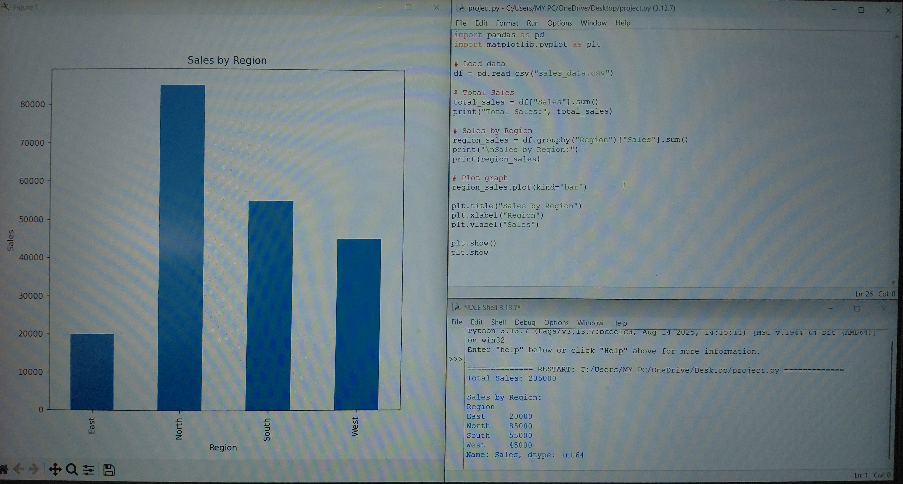
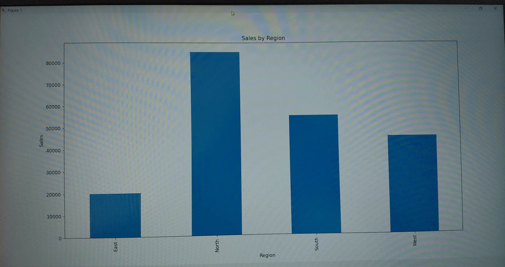

# 📊 Sales Data Analysis using Python
 
## 📌 Project Overview
This project analyzes sales data using Python to gain insights into total sales, profit, and region-wise performance.
 
## 🛠️ Tools Used
- Python
- Pandas
- Matplotlib
 
## 📊 Key Insights
- Total sales and total profit calculated
- Region-wise sales analysis performed
- Category-wise sales comparison
- Data visualized using bar charts
 
## 📂 Files Included
- project.py
- sales_data.csv
- sales_chart.png
 
## 📸 Output
 
### 📊 Sales by Region

 
## 👩‍💻 Author
Srishti Pandey
